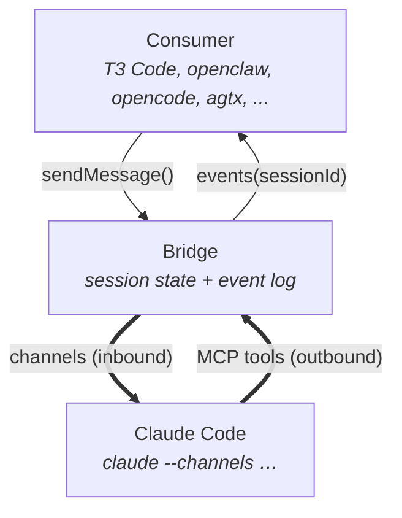

# Architecture

## The idea

Channels for inbound general content, MCP tools for outbound general content. Together they let
an external consumer drive a running, already-authenticated Claude Code session without
restarting it, without scraping the terminal, and without talking to the model API directly. The
bridge owns session state and an append-only event log; Claude Code remains the agent runtime;
the two communicate over a thin per-session control connection between the bridge and a stdio
MCP server that Claude Code spawns as its own child.

> "Channels" refers to the MCP notification mechanism that Claude Code exposes for external
> systems to push content into a running session (see the [channels reference](https://code.claude.com/docs/en/channels-reference)).
> It is not a single bidirectional pipe for arbitrary content: the general-content direction
> is server-to-claude; outbound general content from claude uses regular MCP tools. The
> channels reference also documents a permission-routing capability that is bidirectional in
> a narrow, fixed-shape way (see [Channel direction notes](#channel-direction-notes)).

## The diagram



The Consumer talks to the Bridge with a plain async API. The Bridge talks to
Claude over two one-way pipes: channels carry inbound content into the session,
MCP tools carry outbound content back. The channel-server process that physically
implements those pipes is shown in the detailed diagram above.


### Detailed diagram

```text
                  inbound: channels (one direction)
                  ---------------------------------->

  +---------------+    sendMessage()    +-----------------------------------+
  |  Consumer     | ------------------> |  Bridge process                   |
  |  (ccb demo,   |                     |  +------------------------------+ |
  |   T3 Code,    | <------------------ |  | EventBus + JsonlEventStore   | |
  |   agtx, ...)  |  events(sessionId)  |  | Supervisor (Mock | Serve |   | |
  +---------------+                     |  |  ClaudeCode)                 | |
                                        |  | ControlServer (loopback TCP) | |
                                        |  +--------------+---------------+ |
                                        +-----------------+-----------------+
                                                          | JSON-lines
                                                          | deliver / tool
                                                          v
  +-----------------------------+        spawn       +----------------------+
  | Claude Code process         | -----------------> | Channel server       |
  | (claude --channels ...)     |  stdio MCP child   | (ccb-channel-server) |
  |                             | <----------------- |  ControlClient       |
  | notifications/claude/channel|  MCP notification  |  MCP tool handlers   |
  | <channel source="ccb" ...>  | -----------------> |  bridge_reply/       |
  | bridge_reply / _progress /  |  MCP tool call     |  _progress / _done   |
  | _done                       |                    |                      |
  +-----------------------------+                    +----------------------+

                  <----------------------------------
                  outbound: MCP tools (other direction)
```


## Process topology

Three processes are involved in a real session. The bridge process is the long-lived host: it
owns the `EventBus`, the JSONL store, the `Supervisor` instance, and the loopback
`ControlServer` that listens on `127.0.0.1:<port>`. The `claude` process is launched separately
(by the user in manual smoke, by the supervisor in managed launch) with `--mcp-config` pointing
at a per-session JSON document that names `ccb-channel-server` as an MCP server. Claude Code
spawns that channel server as its own stdio subprocess, hands it the bridge endpoint via
`CCB_BRIDGE_ENDPOINT` and the wire session id via `CCB_SESSION_ID`, and the channel server
dials back to the bridge over loopback TCP. From that point onward, the bridge and the channel
server are siblings under different parents, glued together by one per-session JSON-lines
control connection.

This split is forced by Claude Code's MCP model: MCP servers are stdio children of `claude`,
not of the consumer. So the channel server cannot be embedded in the bridge process and the
control connection is the only place the two sides meet. The envelope spec (`hello`,
`hello_ack`, `deliver`, `tool`, `close`) and the rationale for loopback TCP over Unix sockets
and named pipes live in [`packages/mcp-channel/src/control.ts`](../packages/mcp-channel/src/control.ts).

## How a turn flows

1. Consumer calls `bridge.sendMessage(sessionId, "hello")`.
2. The bridge mints a `messageId`, emits `message.sent`, persists it to
   `.ccb-data/<bridge-uuid>.jsonl`, and forwards the content to its `Supervisor`.
3. The supervisor (typically `ServeSupervisor` for `ccb serve` or `ClaudeCodeSupervisor` for
   managed launch) asks its `ControlServer` to deliver the message to the session's socket.
4. The `ControlServer` writes a single JSON line — `{"type":"deliver","content":"hello",...}` —
   over the loopback TCP control connection to the `ControlClient` running inside the channel
   server process.
5. The channel server emits an MCP notification `notifications/claude/channel` with the content
   and `meta`. The bridge stuffs `session_id` and `message_id` inside `meta` by convention; the
   notification's first-class fields per the channels reference are `content` and `meta`.
6. Claude Code surfaces the inbound text in the running session as
   `<channel source="ccb" session_id="..." message_id="...">hello</channel>`. The `source`
   attribute is populated by Claude Code from the registered MCP server name (`ccb`). The
   other attributes come from `meta` keys; both sides validate keys against
   [`META_KEY_PATTERN`](../packages/mcp-channel/src/meta-validation.ts) to prevent XML
   attribute injection.
7. Claude responds by calling the `bridge_reply` MCP tool (or `bridge_progress` /
   `bridge_done`), with `content`, `final:true`, and the inbound `messageId`.
8. The channel server's `onTool` callback forwards `{"type":"tool","name":"bridge_reply","args":...}`
   back over the same TCP control connection to the bridge's `ControlServer`.
9. The bridge translates the tool call into a `BridgeEvent` (`agent.progress`, `agent.reply`,
   `agent.done`), appends it to the JSONL store, and fans it out on the `EventBus`.
10. The consumer's `for await (const ev of bridge.events(sessionId))` loop yields the event.

## Why this shape

The bridge's only job is to be a clean integration surface for an interactive `claude` that is
already authenticated and running. Every alternative considered for either direction either
re-spawns the model context, scrapes the terminal, or reduces the session to a one-shot — all
explicit non-goals.

`claude --print` runs a single non-interactive turn and exits. It loses tool state, session
history, MCP server connections, and any prior context. It is fine for scripting one-off
prompts, but it cannot drive a long-lived interactive session, which is the whole point.

Terminal scraping (tmux `capture-pane`, ANSI parsing) is brittle. It breaks every time the
Claude Code UI changes, it has no semantic shape (a tool call and a paragraph of prose look
identical to a regex), and it requires constant maintenance. It is ruled out.

The Claude Agent SDK is the wrong primitive: it spawns a new model context for each invocation
rather than driving an existing one. The bridge wants to talk to an already-running, already-
authenticated `claude` — not to start a fresh agent loop with its own auth and config.

Channels exist for exactly this case. Anthropic introduced them so external tools can push
events into a running Claude Code session. The bridge declares the
`capabilities.experimental['claude/channel']` capability on its MCP server, registers three
outbound tools, and lets the model itself decide when to call them. The channel goes in; the
tools come out; the JSONL event log is the durable record.

| direction | mechanism | alternative considered | why not |
|---|---|---|---|
| inbound (bridge -> claude) | `notifications/claude/channel` | PTY write to stdin | brittle; shows up as user typing |
|   |   | spawn `claude --print` per turn | one-shot; loses interactive state |
|   |   | Claude Agent SDK | re-spawns the model context |
| outbound (claude -> bridge) | MCP tools `bridge_reply` / `bridge_progress` / `bridge_done` | terminal scraping / `capture-pane` | non-goal; breaks on UI changes |
|   |   | `claude --print --output-format stream-json` | one-shot; loses interactive state |
|   |   | Claude Agent SDK | re-spawns the model context |

## Using the library

```ts
import { Bridge } from "@ccb/core";
import { mockSupervisorFactory } from "@ccb/claude-code";

const bridge = new Bridge({
  storeDir: ".ccb-data",
  supervisorFactory: mockSupervisorFactory(),
});
const { id } = await bridge.startSession({});
const events = bridge.events(id);
await bridge.sendMessage(id, "hello world");
for await (const ev of events) {
  console.log(ev);
  if (ev.type === "agent.reply" && ev.final) break;
}
await bridge.close(id);
```

Swap `mockSupervisorFactory()` for a real `Supervisor` implementation to drive a real `claude`
process. The four packages that make up this surface:

- `packages/core` (`@ccb/core`) — `Bridge` facade, `EventBus`, `JsonlEventStore`, `Supervisor`
  interface, public types.
- `packages/mcp-channel` (`@ccb/mcp-channel`) — MCP channel server, control server/client,
  `ccb-channel-server` stdio binary.
- `packages/claude-code` (`@ccb/claude-code`) — `MockSupervisor`, `generateMcpConfig`, and the
  `ClaudeCodeSupervisor` managed-launch implementation.
- `apps/ccb` (`@ccb/cli`) — developer CLI (`demo`, `mcp-config`, `serve`).

## Choosing a supervisor

The `Supervisor` interface has three production-relevant implementations. They share the
same wire protocol (channels in, MCP tools out, JSONL store) and the same `BridgeEvent`
contract — they differ only in who is responsible for spawning `claude`.

| supervisor | who spawns `claude` | use it when |
|---|---|---|
| `MockSupervisor` | nobody — in-process echo | unit tests, demos, anything that does not need a real model |
| `ServeSupervisor` | someone else (a human, a script, an orchestrator) | the bridge runs as a service; an external process launches `claude` with the bridge's `--mcp-config` and the channel server dials back |
| `ClaudeCodeSupervisor` | the bridge itself, via `node-pty` | one-command convenience: `ccb demo --supervisor=claude` |

`ClaudeCodeSupervisor` is a **convenience layer**, not a requirement. It bundles
"spawn `claude` + run the bridge" into a single command. A consumer that already has its
own process orchestration (systemd, supervisord, a tmux session, a custom launcher,
the `bin/ccb-launcher.cjs` harness) does not need it.

### Today's working pattern on Bun-on-Linux

On Bun-on-Linux the managed-launch path currently hits a bug downstream of the bridge
itself — `claude`, spawned under Bun's PTY, doesn't reliably initialize its MCP child.
The fix is in upstream Bun (tracked at oven-sh/bun#25822 + adjacent gaps). Until that
lands, the supported real-`claude` pattern on Bun-on-Linux is **`ServeSupervisor` plus an
external launcher**:

- **Bridge under Bun**:
  `bun apps/ccb/src/cli.ts serve --endpoint 127.0.0.1:18486 --session-id <uuid> --format json`
- **Claude spawned externally**:
  - The Node diagnostic harness (`bin/ccb-launcher.cjs`) — the current
    best Linux+Bun launcher; documented in [`SMOKE.md`](./SMOKE.md).
  - A human in another terminal (the two-terminal manual procedure in
    [`SMOKE.md`](./SMOKE.md)).
  - Any process orchestrator that knows how to invoke
    `claude --dangerously-load-development-channels server:ccb --mcp-config <file> ...`
    with the right env vars.

This pattern is verified end-to-end: the bridge produces
`agent.reply{final:true, content:"11 squared is 121."}` in its JSONL when paired with
the harness. The protocol and library are sound; only the convenience layer is gated.

### Implication for consumers

A third-party consumer (a UI, an orchestrator, an SDK user) writes against the `Bridge`
library + `ServeSupervisor`. They do not need `ClaudeCodeSupervisor` at all — they just
need to know how to launch `claude` with the bridge's MCP config, which the diagnostic
harness demonstrates in about 200 lines of clear Node. Once Bun's NAPI gap closes,
`ClaudeCodeSupervisor` becomes the one-command convenience again and any consumer that
wants it can swap in `claudeCodeSupervisorFactory()` without changing protocol or events.

## Channel direction notes

"Channels" describes the inbound MCP notification mechanism. The general-content direction
goes server-to-claude only. There is no claude-to-server channel notification for arbitrary
content; that direction uses regular MCP tools, which is why the bridge exposes
`bridge_reply` / `bridge_progress` / `bridge_done` as the outbound surface.

The channels reference also describes a permission-routing capability that is bidirectional but
narrowly scoped: when Claude Code would normally show an in-terminal tool-approval prompt, an
MCP server that opts into this capability can receive the prompt over a notification, present
it to a human elsewhere, and reply with an allow/deny decision over a paired notification. The
payloads are fixed and tied to tool-approval semantics; this is not a general claude-to-server
content channel. The bridge does not advertise this capability today; if a consumer needs
permission-prompt routing, the bridge would opt in explicitly and handle both halves. See
[ROADMAP.md](./ROADMAP.md) for the milestone where this lands.

The handshake for both capabilities is unilateral on the bridge side: the MCP server
advertises `experimental['claude/channel']` (and, optionally, the paired permission capability),
Claude Code detects them at connection time, and registers handlers once a runtime gate passes
(account-eligible, `--channels` flag listing this server, etc.). Claude Code does not advertise
a reciprocal client capability the bridge needs to read.

## What channels + MCP doesn't give you

A richer UI (the T3 Code shape, an orchestrator that wants to render tool timelines) needs
things that channels + the three bridge tools don't carry on their own:

- Tool calls Claude makes mid-turn (Bash, Edit, Write, Read, Grep, Glob, ...).
- Mid-stream partial text (token-level streaming inside a single reply).
- Extended thinking blocks.
- Permission-prompt routing (the "Allow this tool?" interactive UX).

Claude Code hooks (`PreToolUse`, `PostToolUse`, `Stop`, `SessionStart`, `UserPromptSubmit`, ...)
are the natural extension point for the first three. The `tool.event` variant of
`BridgeEvent` in `packages/core/src/events.ts` is reserved for hook-relayed payloads — it is
currently dead code waiting for a wire-up task. Hook relay is a roadmap item; see
[ROADMAP.md](./ROADMAP.md).

Token-level streaming is not on the roadmap. Every available path to it (the Agent SDK,
`--print --output-format stream-json`) re-violates the bridge's non-goal of being the model
API's consumer. Channels deliberately deliver complete messages, not tokens.

## Where to go next

- [`../README.md`](../README.md) — install, run the demo, full CLI reference.
- [`SMOKE.md`](./SMOKE.md) — real-claude smoke: managed-launch (primary, one command) and the two-terminal manual fallback (with the plugin install variant).
- [`ROADMAP.md`](./ROADMAP.md) — milestone index; current shipped scope, planned work, and
  proposals.
- [`../packages/core/src/events.ts`](../packages/core/src/events.ts) — the `BridgeEvent` union
  (the data contract every consumer sees).
- [`../packages/mcp-channel/src/channel-server.ts`](../packages/mcp-channel/src/channel-server.ts) —
  where `capabilities.experimental['claude/channel']` is declared and where the three bridge
  tools are registered.
- [`../packages/mcp-channel/src/control.ts`](../packages/mcp-channel/src/control.ts) — the
  JSON-lines TCP control protocol that splices the bridge and channel-server processes
  together.
- [Channels reference](https://code.claude.com/docs/en/channels-reference) — Anthropic's
  protocol documentation for `notifications/claude/channel`, including the permission-routing
  capability mentioned above.
